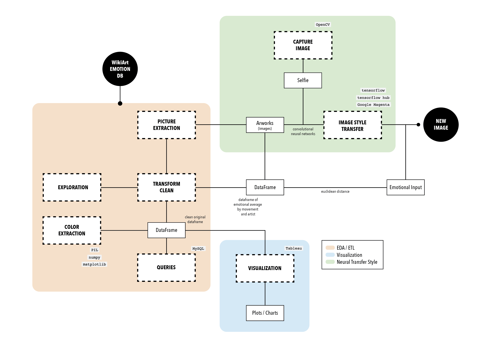

# DAT(A)RT - Can technology be used to explore art by the way we feel?

## Table of Contents

- [Project Description](#project-description)
- [Database](#database)
- [Workflow](#workflow)
- [Neural Transfer Style](#neural-transfer-style)
- [My Model](#my-model)
- [Results](#results)
- [Organization](#organization)
- [Next steps](#conclusions)
- [Links](#links)

## Project Description
Art has been a popular form of expression throughout history, capable of evoking emotions, stimulating thought and awakening emotional responses in those who appreciate it. Several studies have proved that art and creativity are attributes that have played a significant role in the evolution and natural selection of human beings.However, understanding how and why paintings evoke emotions is still a challenge.

In this context, emerges the Dat(A)rt project, which aims to explore the interaction between art and the viewer using technology as an ally. The main focus has been the application of image style transfer technique, allowing to blend a classic artwork with a selfie and thus establishing a dialogue between both forms of expression.

## Database
The data handled in this project is based on the "WikiArt Emotions" dataset. This dataset was compiled from WikiArt and annotated by crowdworkers for the research paper entitled "WikiArt Emotions: An Annotated Dataset of Emotions Evoked by Art", by Dr. Saif M. Mohammad and Dr. Svetlana Kiritchenko. As a result, 4,019 images were obtained representing 22 categories of four major styles: Renaissance, Post-Renaissance, Modern and Contemporary.

Each artwork in the dataset was annotated by ten crowdworkers, who were presented with a set of 20 emotion words classified as "Positive Emotions", "Negative Emotions" and "Mix/Neutral". The crowdworkers were asked to make annotations based on:

* __Scenario I__: presenting only the image of the work (without title)
* __Scenario II__: presenting only the title of the artwork (no image)
* __Scenario III__: presenting both the title and the image of the artwork

In addition, each individual was asked to rate:

* The artwork on a scale of -3 (strongly dislike) to 3 (strongly like)
* Whether the image shows the face/body of a person/animal
* Whether it is a painting or a different thing (e.g., a sculpture)

## Workflow

## Neural Transfer Style

Neural transfer is a technique in deep learning and computer vision that blends a content image and a style reference image to generate a new output image that combines features of both. The content image provides high-level information and structure, while the style image captures textures, colors and patterns. These features are extracted using a convolutional neural network to achieve a new image.

 
A convolutional neural network (CNN) is a type of machine learning algorithm used in image processing and visual recognition. It works as follows:

1. __Image input__: reception of an image as input composed of pixels, which represent the different colors and structures in the image.
2. __Convolution__: application of filters, small matrices on the image that calculate a weighted combination of the pixel values at each position to highlight particular features in the image.
3. __Feature maps__: generation of feature maps highlighting the regions where they were detected.
4. __Grouping__: pooling operation to the feature maps to reduce dimensionality while preserving key features.
5. __Fully connected layers__: use of fully connected layers to classify extracted features and make predictions. These layers take the input features and process them to generate the final network outputs.
6. __Learning and optimization__: Adjustment of filter weights and fully connected layers using machine learning techniques. The network is trained by gradually updating the weights to minimize the difference between the network predictions and the actual image labels.
7. __Prediction and output__: prediction and classification of new images based on their training.

## My Model
My model uses style neural transfer and convolutional neural networks (CNN) to fusion a content image (selfie) and a style reference image (chosen from the dataset based on user sentiments) to generate a new image that combines features from both. In my implementation, I use the open source Tensorflow library, together with the Tensorflow Hub extension, which facilitates the use of pre-trained machine learning models. To improve performance and model loading time, I set an environment variable to load the models in compressed format to allow faster data processing. I also use Google Magenta arbitrary image styling model, which specializes in image styling transfer. 

* __Tensorflow__: open source library used for machine learning tasks and neural network model development.
* __Tensorflow Hub__: Tensorflow extension that provides pre-trained machine learning models.
* __Environment variable__: used by TensorFlow Hub to compress the format of the models.
* __Google Magenta__: arbitrary image styling model.

## Results

(video folder)

## Organization
<u>Notebooks</u>
 * __Image Extraction__: Extraction of all the images of the database into folders by artistic movement.
* __Data Cleaning__: Transformation and cleaning of the data. 
* __MySQL Import__: Import of the final .csv into MySQL to perform some queries.
* __Take Your Picture__: Capture of a picture with the webcam by using OpenCV.
* __Neural Transfer Style__: Implementation of style transfer between the extracted artworks and the picture captured by the camera by using a TensorFlow.

<u>Data</u>
 * __WiKiArt Emotions (folder)__: Original .csv files from WikiArt Emotion DataBase.
 * __Palettes/Movement (folder)__: .csv files resulting from the color analysis.
 * __Artwiki_queries (file)__: .sql file with queries to explore the data.
* __WikiArt Emotions Clean (file)__: Final .csv after applying EDA and ETL processes.
 * __df artist (file)__: Final .csv filtered with the average of positive, neutral and negative emotions by artist.
 * __df movement (file)__: Final .csv filtered with the average of positive, neutral and negative emotions by movement.

<u>Images</u>
* Color palettes by artistic movement resulting from the color analysis performed.

## Next steps

01. Extend the database by collecting information from more artworks, more movements and more authors.
02. Experiment with more complex neural networks to improve to generate images of higher quality and accuracy during style transfer.
03. Create color palettes by artist to explore new metrics and patterns, such as the evolution of color preferences over time.
04. Optimize some redundant code features.
05. Consider feedback from real users to identify possible improvements to the interface and functionality.

## Links
[WikiArt Emotion DB](http://saifmohammad.com/WebPages/wikiartemotions.html)

[Tableau report](https://public.tableau.com/app/profile/bego.ripoll/viz/DATART/sheet7?publish=yes)

[TensorFlow](https://www.tensorflow.org/tutorials/generative/style_transfer?hl=es-419)

[TensorFlow Hub](https://www.tensorflow.org/hub?hl=es-419)

[Google Magenta](https://tfhub.dev/google/lite-model/magenta/arbitrary-image-stylization-v1-256/int8/prediction/1)
